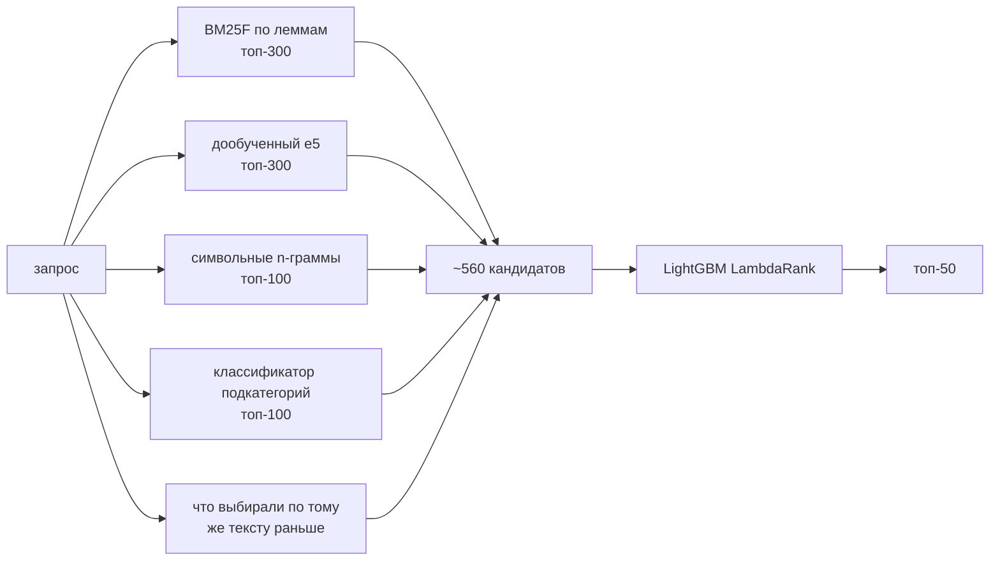

# Кандидатогенерация для поиска Авито Услуг

Задача — по поисковому запросу выбрать из корпуса в 189 тысяч объявлений до 50 кандидатов так, чтобы среди них
оказались объявления, которые пользователь в итоге выбрал. Метрика — Recall@50.

Результат на платформе — **Recall@50 = 0.924**. На моей локальной валидации получалось 0.958; почему есть разница,
разбираю ниже, в разделе про проверку качества.

## Как запустить

```bash
python -m venv .venv
.venv\Scripts\activate          # на Linux/macOS: source .venv/bin/activate
pip install torch==2.11.0 --index-url https://download.pytorch.org/whl/cu128
pip install -r requirements.txt
python main.py
```

Перед запуском нужно положить данные в `data/` (см. [data/README.md](data/README.md)), а веса дообученной модели —
в `models/e5-avito/` (см. [models/README.md](models/README.md)). Ответ появится в `submission/answer.csv`;
перед записью скрипт сам проверяет формат по требованиям задания.

С готовыми весами полный прогон занимает около 35 минут, без них — около 1 ч 45 мин (модель дообучится заново).
Нужна видеокарта NVIDIA с 8 ГБ памяти и 32 ГБ оперативной памяти. Всё промежуточное складывается в `cache/`,
поэтому повторный запуск пропускает уже посчитанные шаги.

## Коротко о решении

Схема двухэтапная. Сначала несколько простых поисков набирают широкий список кандидатов, потом градиентный бустинг
переупорядочивает их и оставляет топ-50.



Источников несколько, потому что каждый ловит свой тип запросов. BM25 хорошо находит точные совпадения слов
(«баня на дровах»). Эмбеддинги — синонимы: «разгрузка вагонов» → «Бригада грузчиков». Символьные n-граммы
спасают от опечаток и слитного написания («масажистка», «грузтакси»). Классификатор подкатегорий помогает, когда
у запроса и объявления вообще нет общих слов: «бровки» → «Мастер бровист». Вместе они дают примерно 560 кандидатов
на запрос, и в них попадает 98.6% правильных ответов. Дальше задача ранкера — поднять эти ответы в первую
полусотню.

## Что я увидел в данных

Подробный разбор — в [notebooks/01_eda.ipynb](notebooks/01_eda.ipynb), здесь главное.

**Локация решает очень многое.** 83% выборов — объявление из той же локации, что и поиск. Остальное — пригороды
и соседние города, а ещё поиск по «регионам»: например, у локации `107620` (судя по всему, «Москва и область»)
своих объявлений нет вообще, 61% выборов оттуда уходит в Москву. Поэтому я не стал жёстко фильтровать по
локации, а выучил по истории вероятность P(локация объявления | локация поиска) и добавил её к скору. Уже одно
это поднимает BM25 с 0.45 до 0.84.


**Описание объявления нужно индексировать.** Хотя бы одно слово запроса есть в заголовке у 78% пар, в заголовке
с параметрами — у 87%, а с описанием — у 96%. При этом заголовок важнее всего, поэтому в BM25F у него вес 5, а у
параметров и описания — по 1.

**Фильтры почти всегда соблюдаются.** Если в запросе стоит «Вид услуги» или «Тип услуги», выбранное объявление
соответствует ему в 98% случаев. Я даю бонус объявлениям, которые проходят фильтр, но не выкидываю остальные.

**Популярных исполнителей выбирают повторно** — 40% выборов приходятся на объявления, которые выбирали и по другим
запросам. Отсюда признаки популярности.

**Самое важное — как устроен бенчмарк.** Каждый текст запроса встречается в нём один раз, и только 37% этих
текстов есть в train. Если бы запросы брали случайно из потока поиска, в train нашлось бы 87% из них. А вот если
брать по одному запросу на уникальный текст, получается 38% — почти точное совпадение. То есть в бенчмарке в
основном редкие, «хвостовые» формулировки, и валидацию нужно строить так же.


## Признаки

Для ранкера на каждую пару «запрос — кандидат» считается около 60 признаков:

| Группа | Что внутри |
|---|---|
| текст | BM25F и BM25 по каждому полю, доля слов запроса в заголовке / параметрах / описании (в том числе с весом IDF), входит ли запрос в заголовок целиком, косинус n-грамм и эмбеддингов, ранги кандидата в каждом источнике |
| локация | P(локация объявления \| локация поиска), та же ли локация, расстояние до центра локации поиска, сколько объявлений в локации |
| фильтры | сколько ключей фильтра объявление выполняет, выполняет ли все, отдельно «Вид услуги» и «Тип услуги» |
| подкатегория | P(подкатегория \| запрос) из классификатора, популярность подкатегории, насколько она «локальная» (у онлайн-услуг низкая доля выборов в своём городе), спрос на неё в локации поиска |
| популярность | сколько раз и по скольким разным запросам объявление выбирали, выбирали ли его по этому же тексту, число отзывов, рейтинг |
| объявление и запрос | цена, длина текстов, скрыт ли телефон; длина запроса, есть ли фильтр, встречался ли такой текст раньше |

Не использовал только `search_is_delivery_search` — в бенчмарке он всегда 0 — и сам `item_id`: 90% объявлений
корпуса в train не встречаются, так что запоминать идентификаторы бессмысленно.

## Модели

- **Лемматизация** — pymorphy3. Каждое уникальное слово разбирается один раз, иначе слишком медленно.
- **BM25F** — написан на разреженных матрицах scipy, скоры по всему корпусу считаются одним умножением матриц.
- **Символьные n-граммы** — TF-IDF по n-граммам длины 3–5 из заголовка.
- **Эмбеддинги** — `intfloat/multilingual-e5-base`, дообученный на 254 тысячах пар «запрос → выбранное объявление»
  (MultipleNegativesRankingLoss, одна эпоха, около часа на ноутбучной RTX 3080). До выбора модели я сравнил её с
  `deepvk/USER-base`: без дообучения e5 оказалась чуть лучше (R@50 0.831 против 0.820) и заметно быстрее.
  Дообучение подняло R@50 этого источника с 0.831 до 0.891.
- **Классификатор подкатегорий** — логистическая регрессия на TF-IDF лемм и символьных n-грамм. Угадывает
  подкатегорию с первого раза в 69% случаев, для новых текстов — в 66%.
- **Ранкер** — LightGBM в режиме LambdaRank. Он оптимизирует порядок внутри запроса и в моём случае на 1 п.п.
  лучше обычной бинарной классификации.

Для запросов с `search_category = 0` (поиск по всем категориям, 9% бенчмарка) используется отдельная версия
ранкера без признаков подкатегории. В train таких запросов почти нет, и правильные ответы там всегда из Услуг —
основная модель выучивает «не услуга — значит, плохо», а в бенчмарке среди таких запросов есть «брусчатка
тротуарная плитка купить» и «вакансия репетитор онлайн».

## Как проверял качество

Валидацию я собрал по образцу бенчмарка: из train берётся по одному запросу на уникальный текст, всего 8 порций по
2452 запроса — столько же, сколько в бенчмарке. Каждая порция ищет в корпусе бенчмарка, к которому подмешаны её
правильные ответы. Порции 0–4 идут на обучение ранкера, 5 — на раннюю остановку, 6–7 (4904 запроса) — на итоговую
оценку. Всё, что учится на истории выборов, включая дообучение эмбеддингов, видит только train без валидационных
запросов. Запросы с фильтром «Автосервис» я в валидацию не брал — в бенчмарке их нет.

Так менялось качество по ходу работы (Recall@50 на порциях 6–7):

| Вариант | R@50 |
|---|---|
| BM25 без учёта локации | 0.450 |
| BM25 + вероятность локации | 0.844 |
| лучший одиночный источник — дообученные эмбеддинги | 0.865 |
| LightGBM над всеми источниками, эмбеддинги без дообучения | 0.948 |
| LightGBM над всеми источниками, дообученные эмбеддинги | **0.958** |

Отдельно проверил, не завышает ли оценку сама схема валидации. 92% правильных ответов в ней — объявления,
подмешанные из train, и если бы модель научилась их отличать от «родных» объявлений корпуса, результат был бы
нечестным. Для ответов, которые и так лежат в корпусе бенчмарка, полнота получилась 0.951 против 0.957 у
подмешанных — разница в пределах погрешности.

На платформе вышло 0.924, на 3.4 п.п. ниже валидации. Думаю, дело в трёх вещах. Во-первых, правильные объявления
бенчмарка почти наверняка реже встречались в train, чем в моей валидации, а такие объявления модель находит хуже
(0.94 против 0.96). Во-вторых, запросы «по всем категориям» я вообще не мог проверить на валидации. В-третьих, в
бенчмарке больше Москвы и Петербурга, где конкуренция между объявлениями выше.

## Какие ошибки нашёл и что с ними сделал

Первым делом я разобрал, где ошибается BM25 с учётом локации. Вне топ-50 у него оставалось 16% правильных ответов:

- **10% — объявление похоже на запрос, но проигрывает таким же.** Например, «ателье ремонт одежды» → «Ремонт одежды
  любой сложности» на 221 месте, хотя у запроса стоял фильтр «Пошив и ремонт одежды», который BM25 никак не
  учитывал. Отсюда бонус за фильтр и ранкер с признаками фильтров, популярности и подкатегории.
- **4% — у запроса и объявления нет общих слов.** Внутри это разные случаи: опечатки («масаж», «апресовка») — под
  них символьные n-граммы; синонимы («хакер» → «Помогу восстановить доступ к аккаунту») — под них эмбеддинги;
  запросы совсем без слов из объявления («бровки») — под них классификатор подкатегорий.
- **2% — объявление из неожиданной локации.** Помогли мягкая вероятность локации вместо фильтра и признак
  «локальности» подкатегории.

У итоговой модели на валидации не находится 4.4% ответов. Примерно треть — объявления, которые проиграли похожим
конкурентам («учитель русского языка» → «Репетитор русский язык» на 443 месте), ещё треть вообще не попала в список
кандидатов, остальное — нетипичная локация или отсутствие общих слов («гувернер» → «Няня»). Часть промахов — явный
шум: «хомяковая крыса» → объявление о продаже Nissan Qashqai.

Ещё пара ошибок нашлась в моём собственном коде, и их стоит упомянуть. У `deepvk/USER-base` в конфиге по умолчанию
включён префикс `query: `, и сначала к текстам приписывалось `query: passage: …` — заметил по карточке модели до
того, как это исказило сравнение. А когда ускорял проверку фильтров (поиск только в коротком окне текста после
ключа), сверка со старым медленным способом показала расхождение на редких длинных фильтрах; для них оставил
полный поиск.

## Что можно улучшить

- Сделать валидацию ещё ближе к бенчмарку: убрать из дообучения эмбеддингов все объявления-ответы валидации, чтобы
  они были для модели такими же новыми, как объявления бенчмарка. Это должно сократить разрыв 0.958 → 0.924 и
  помочь честнее подбирать веса источников.
- Добавить в дообучение эмбеддингов «трудные» негативы — похожие объявления из той же локации.
- Отдельно поработать с запросами по всем категориям.

## Структура репозитория

```
├── main.py                  весь пайплайн: python main.py
├── src/
│   ├── config.py            пути и константы
│   ├── data.py              загрузка данных и валидация по образцу бенчмарка
│   ├── text.py              токенизация и лемматизация
│   ├── retrieval/           источники кандидатов: bm25, chargram, dense (+ finetune)
│   ├── features/            локации, фильтры, классификатор подкатегорий, история выборов
│   ├── candidates.py        объединение источников и расчёт признаков
│   ├── ranker.py            LightGBM LambdaRank
│   ├── metrics.py           Recall@K
│   ├── submission.py        запись и проверка answer.csv
│   └── utils.py
├── notebooks/01_eda.ipynb   разведочный анализ
├── submission/answer.csv    отправленный ответ
├── data/, models/           сюда кладутся данные и веса (в git только README)
└── docs/img/                картинки для README
```

## Воспроизводимость

Все случайности зафиксированы: seed 42 в отборе валидации и дообучении, у LightGBM — `deterministic=True`
и фиксированное число потоков. Я проверял: прогон с нуля в пустую папку кэша с теми же весами модели дал
побайтно тот же `answer.csv`. Контрольная сумма:

```
certutil -hashfile submission\answer.csv SHA256
f3157e4893f544e9acdbaed26e2ae184c070b2ffa1c76d5dcb29c86db95cf152
```

Единственный шаг, который не повторяется бит в бит, — само дообучение эмбеддингов: часть операций на GPU
недетерминирована. Поэтому для точного воспроизведения нужны мои веса (`models/e5-avito`); если обучить модель
заново, качество будет тем же, но отдельные позиции в ответе могут отличаться.

## Что использовал из open-source

| Что | Зачем | Лицензия |
|---|---|---|
| [intfloat/multilingual-e5-base](https://huggingface.co/intfloat/multilingual-e5-base) | эмбеддинги (дообучал) | MIT |
| [deepvk/USER-base](https://huggingface.co/deepvk/USER-base) | только в сравнении, в решение не вошла | Apache-2.0 |
| pymorphy3 и словари OpenCorpora | лемматизация | MIT |
| PyTorch, sentence-transformers, transformers | дообучение и применение эмбеддингов | BSD / Apache-2.0 |
| LightGBM | ранжирование | MIT |
| scikit-learn, SciPy, NumPy, pandas, PyArrow | TF-IDF, логистическая регрессия, разреженные матрицы | BSD / Apache-2.0 |

Модель с Hugging Face скачивается один раз, дальше всё работает локально, без внешних API. Идентификаторы
запросов нигде не используются, кроме записи ответа, а запросы бенчмарка я смотрел только как неразмеченные данные —
чтобы понять, как устроена выборка.
